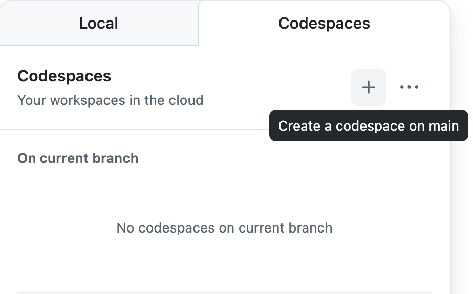

## RPG
勇者(戦士・魔法使い・僧侶)を操作して敵を倒すロールプレイングゲームです．

***

## 演習について
Javaで記述されたゲームです．他の問題よりも少し複雑で規模も大きくなっていますが，**情報応用の講義でみなさん一度は，類似したコードを触っているはずなので，奮ってチャレンジしてみてください！！**
意図的にバグやエラーを残しているので，調べてみたり，生成AIやTAに質問して，いろんな観点で改善点を見つけて報告（issue） & コード変更・機能追加（PullRequest）に挑戦してみてください!

### 課題の例
RPGのゲームとして成立していればなんでもありです．
- リファクタリング
  - 変数名やメソッド名の付け方の統一
  - 冗長な処理の簡略化
  - 可読性の向上
- 出力情報の追加・変更
- 機能追加
  - 逃げる・戦う以外の新たな選択肢の追加

※ わからないこと・気になることがあればTAに声をかけてください


### 実行方法(コードスペースの起動方法)
この文章が見えているページでキーボードの"."を押すか以下の手順で起動できます．
1. 右上の"<> Code"ボタンをクリック
2. 右側の"Codespaces"を選択
3. codespacesの"+"（Create a codespace on main）をクリック



***

## コミット・プッシュ・プルリクエストについて
コミットおよびプッシュ（コード変更）は **必ずブランチを作成してから** 行ってください
（codespace上でコミットを行う場合は，コミット時に表示される注意書きの， 新しいブランチにコミットする を押してください．ブランチを作成してから作業を行なっても問題ありません．ブランチ名は自由ですが"作業内容/氏名"を推奨します）

プルリクエストは，テンプレートを用意しているので，[Pull requests](https://github.com/SocSEL-INFOseminar1-2025/RPG_Java/pulls)から作成することを推奨します

マージ操作は行わないでください

## プログラム実行方法
Javaのコードは，何もせずに実行できるのではなく，**コンパイル(人間が書いたコードを，コンピュータが実行できる形に変換する作業)** が必要になります．
```
//コンパイル
javac -d bin -sourcepath src src/Main.java
```

コンパイルすることで，コードを実行できるようになったので，以下のように実行してみましょう．
```
//コンパイルされたコードを実行
java -cp bin Main
```